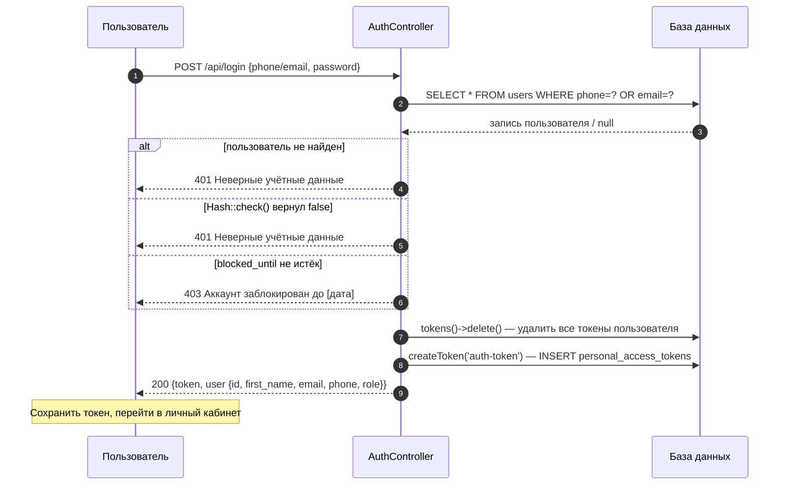
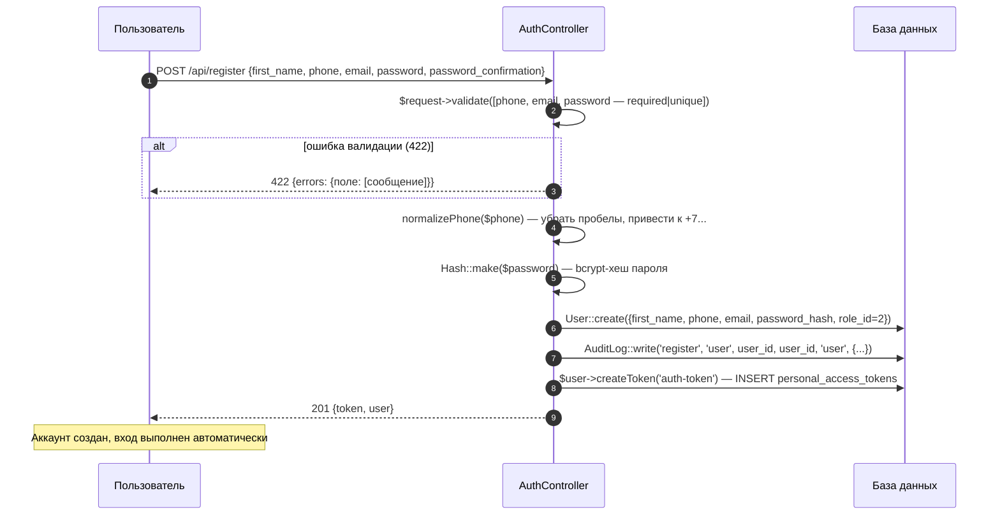
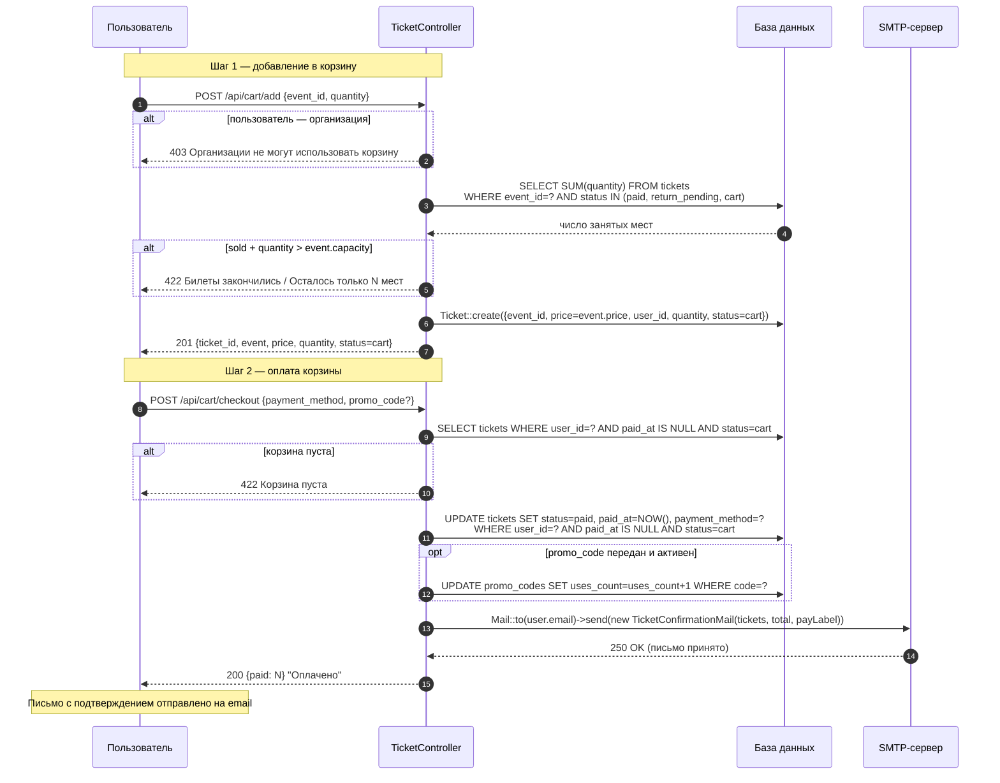
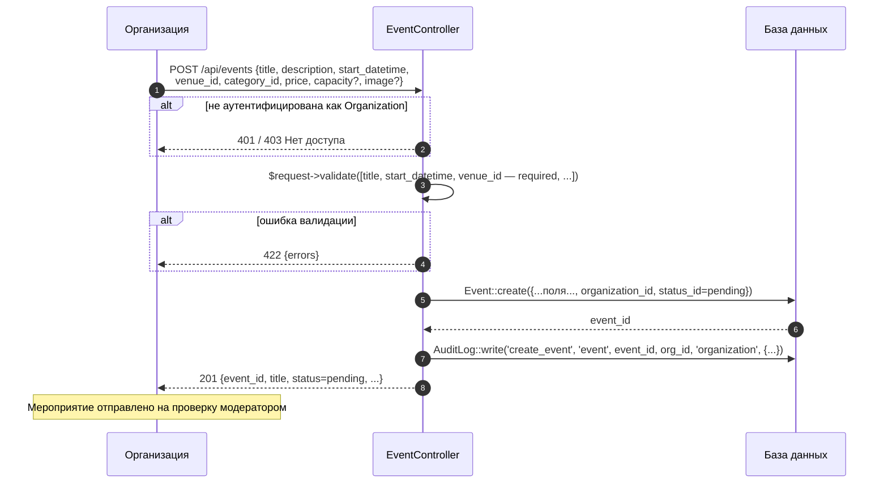
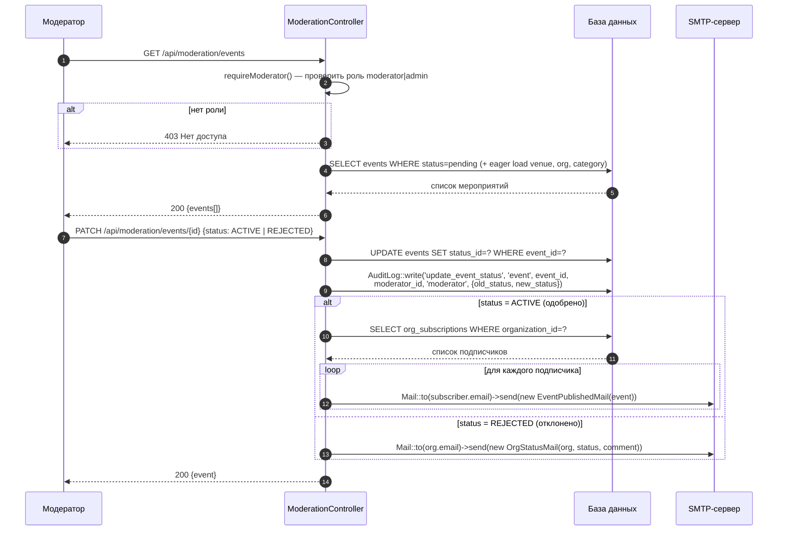
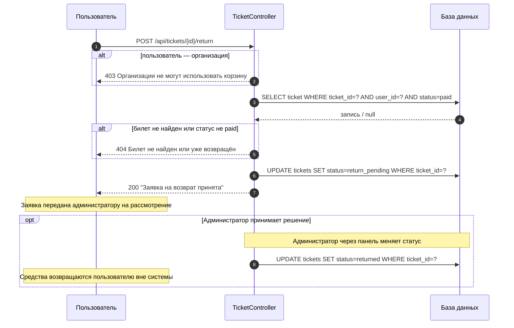
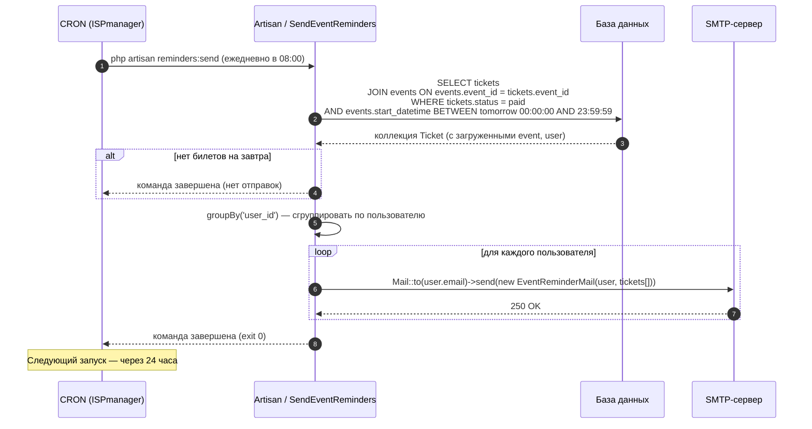

# Диаграммы последовательности

## 1. Авторизация пользователя

---

## 2. Регистрация пользователя

---

## 3. Покупка билета

---

## 4. Создание мероприятия

---

## 5. Модерация мероприятия

---

## 6. Возврат билета

---

## 7. Отправка напоминаний

